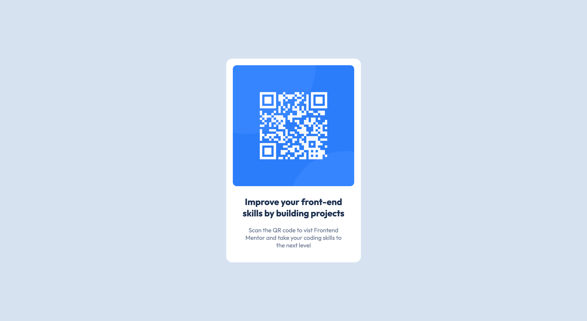

# Frontend Mentor - QR code component solution

This is a solution to the [QR code component challenge on Frontend Mentor](https://www.frontendmentor.io/challenges/qr-code-component-iux_sIO_H). Frontend Mentor challenges help you improve your coding skills by building realistic projects. 

## Table of contents

- [Overview](#overview)
  - [Screenshot](#screenshot)
  - [Links](#links)
- [My process](#my-process)
  - [Built with](#built-with)
  - [What I learned](#what-i-learned)
  - [Continued development](#continued-development)
  - [Useful resources](#useful-resources)
- [Author](#author)
- [Acknowledgments](#acknowledgments)

**Note: Delete this note and update the table of contents based on what sections you keep.**

## Overview

### Screenshot

### Links

- Solution URL: [GitHub Repository](https://github.com/JonKnitt1205/qr-code-css-challenge)
- Live Site URL: [GitHub Pages](https://jonknitt1205.github.io/qr-code-css-challenge/)

## My process
### What I learned

I have used everything in this project before so this project was used to keep myself fresh on basic HTML/CSS because I want to improve on these skills before an upcoming hackathon. The main focus was centering the cardand getting everything to look accurate to the challenge. I also had to use an outside google font which I had never done before.

### Continued development

In order to complete this I was definitely using very hacky teqniques, guessing and checking, not really using any knowledge or skill, just hoping what I wrote was correct. I just want to keep practicing to feel more confident when writing css.

## Author

- Frontend Mentor - [@yourusername](hhttps://www.frontendmentor.io/profile/JonKnitt1205)